<!-- notP 系 -->
<table>
  <tr>
    <td>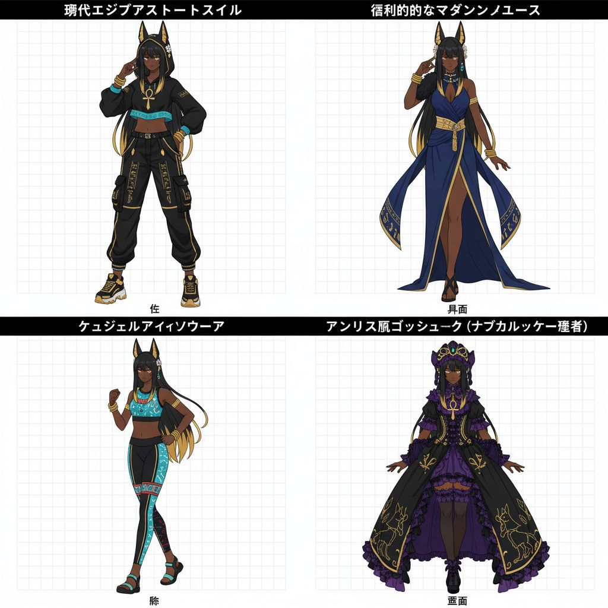</td>
    <td>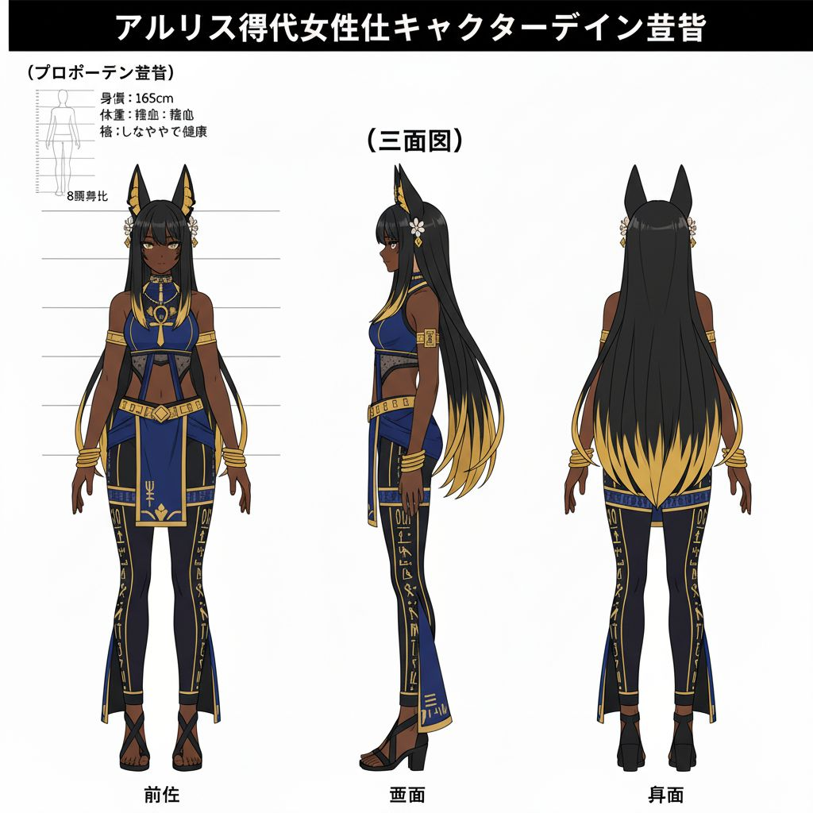</td>
    <td>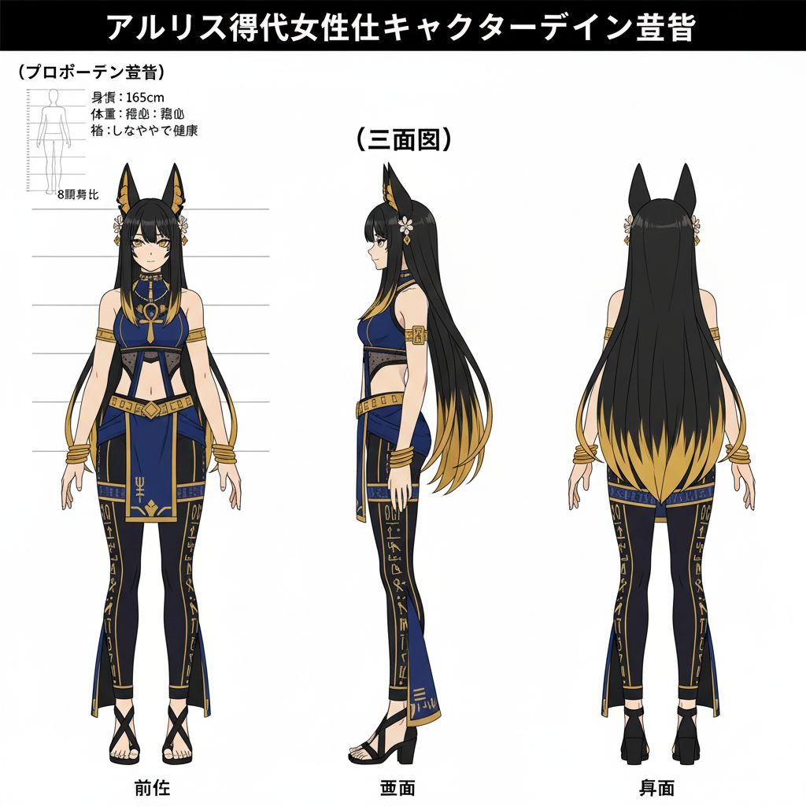</td>
  </tr>
</table>

<!-- 設定B 系 -->
<table>
  <tr>
    <td>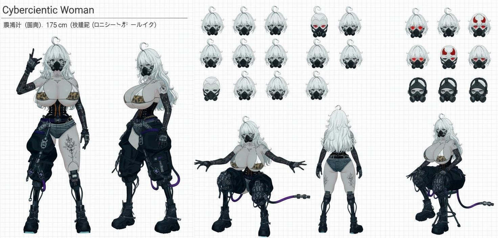</td>
  </tr>
</table>

<!-- 設定J 系 -->
<table>
  <tr>
    <td>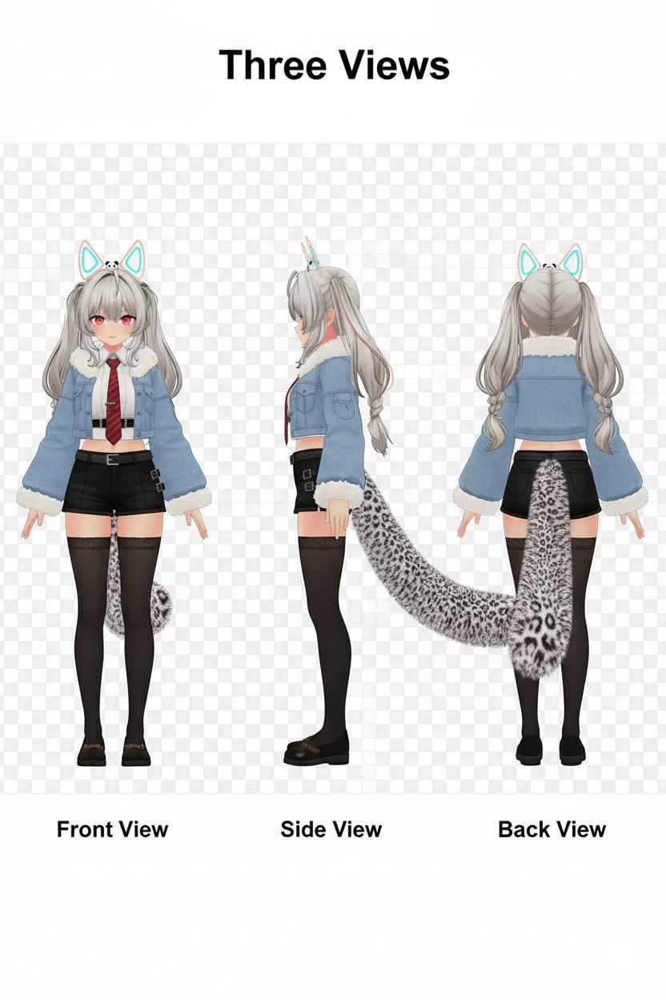</td>
    <td>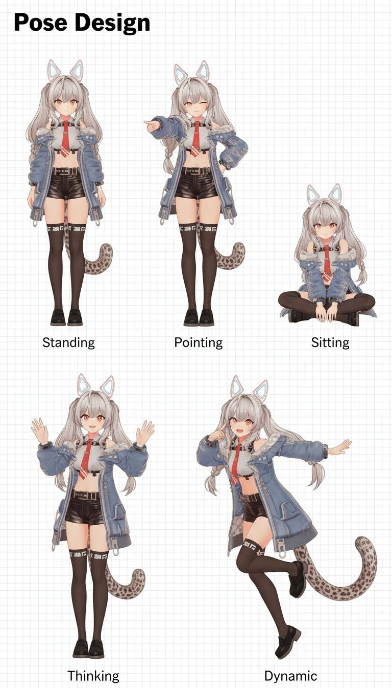</td>
    <td>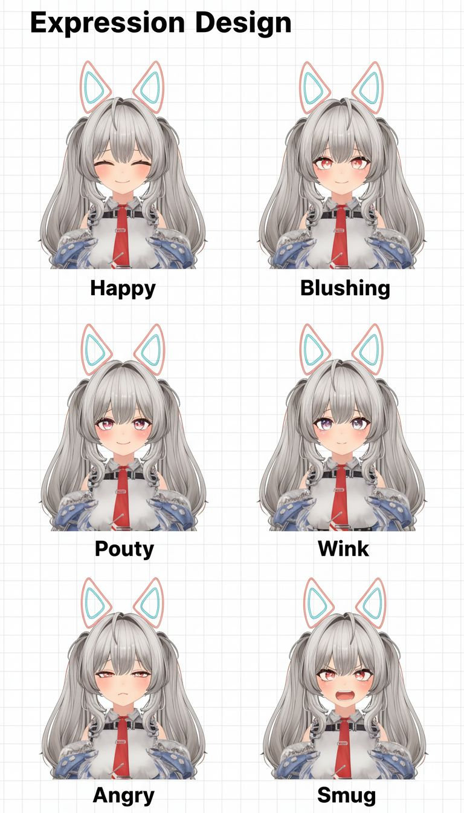</td>
  </tr>
  <tr>
    <td>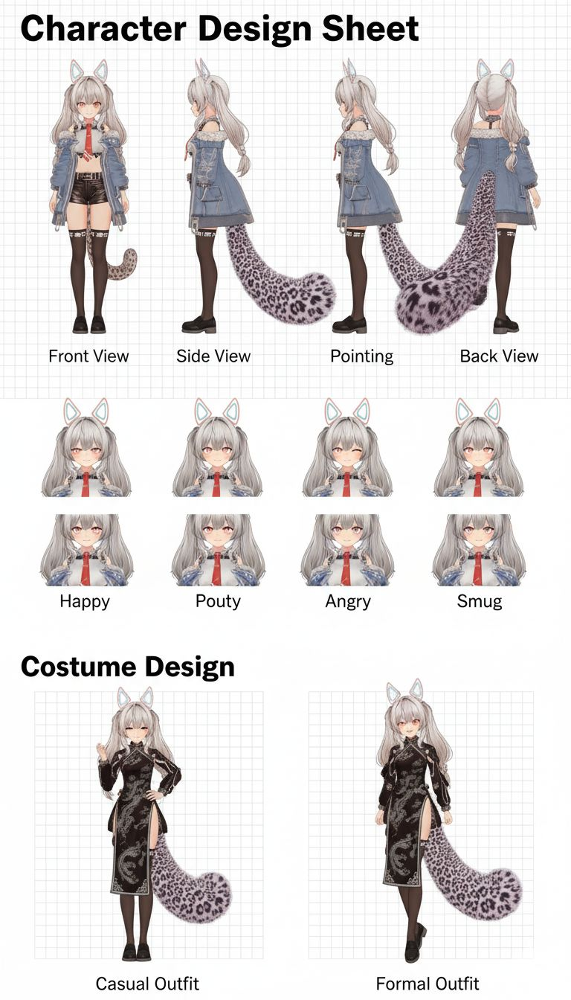</td>
  </tr>
</table>

<!-- 設定K 系 -->
<table>
  <tr>
    <td>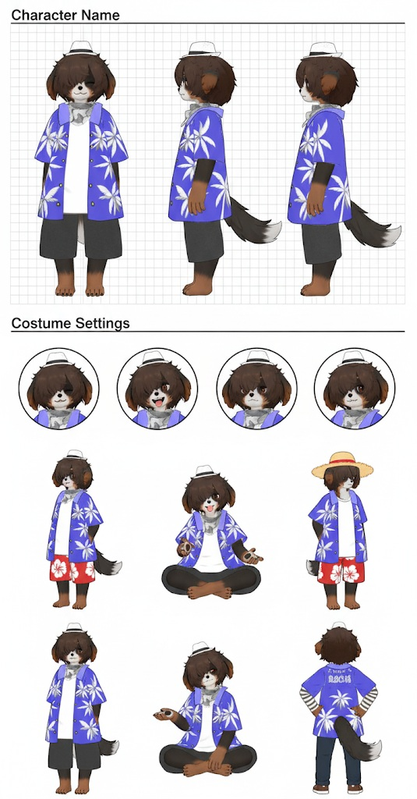</td>
  </tr>
</table>

<!-- 設定S 系 -->
<table>
  <tr>
    <td>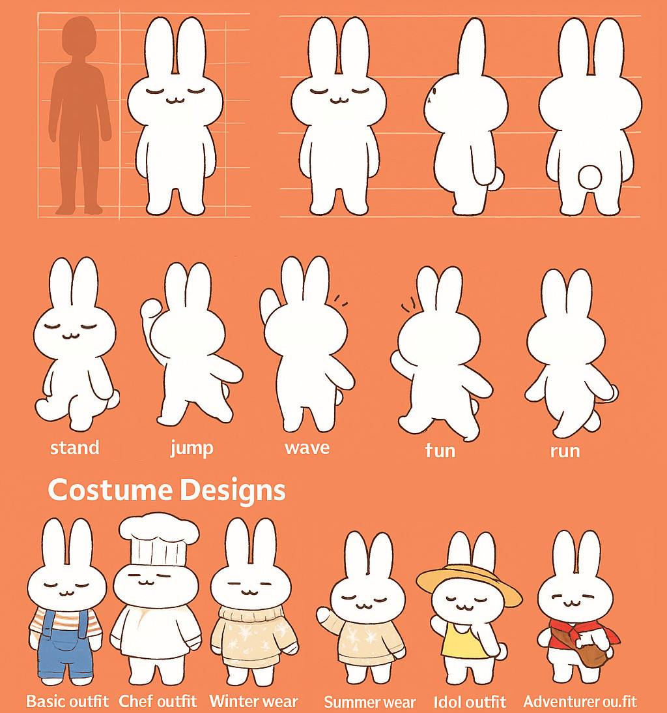</td>
    <td>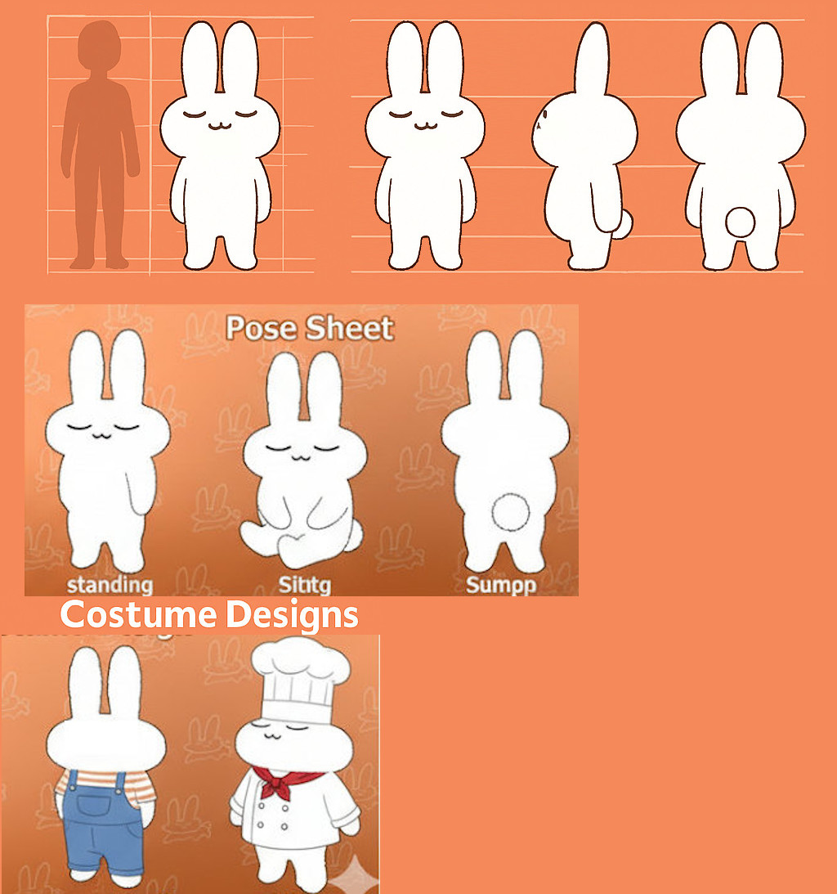</td>
  </tr>
</table>

*こういった推論はGeminiが得意のようだが、それでも細部が適当であるためこれらを元に生成してもうまく行かないことが多い