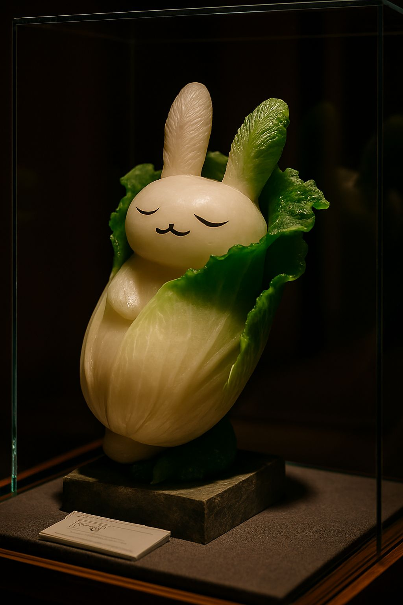
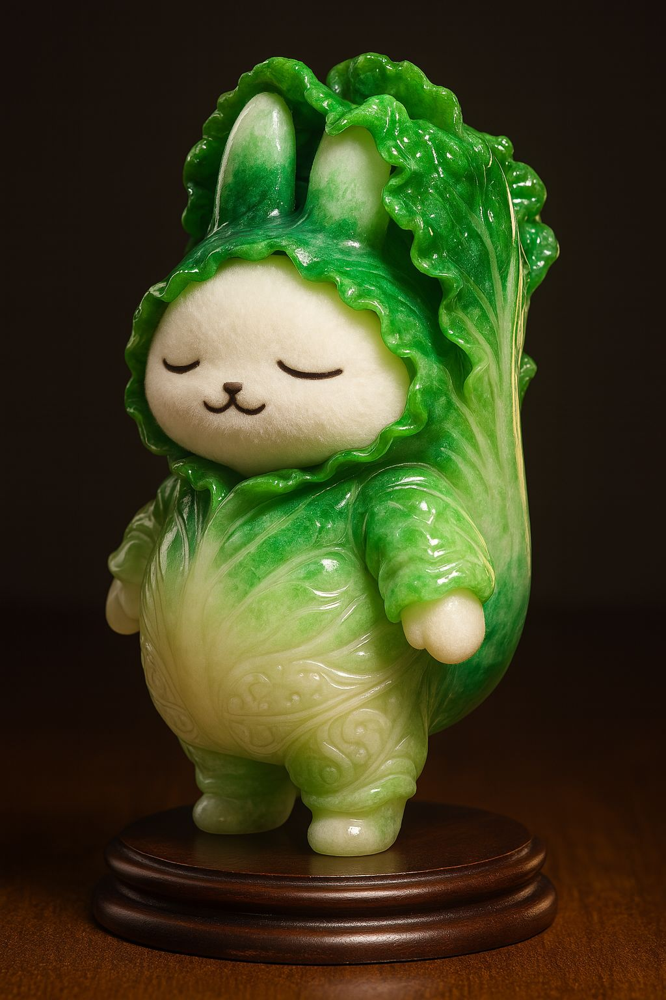
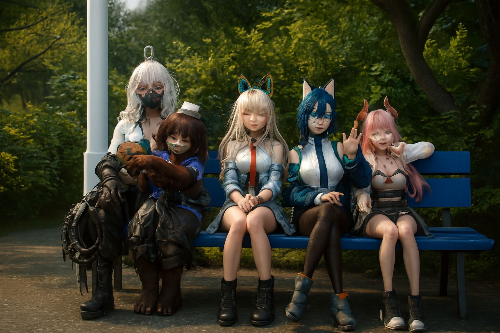

# 🎨 VRChat AI Gallery

VRChatで撮影された写真などのAI加工作品集

## 🖼️ 作品詳細

### 1. クラシック絵画再現

| 作品名 | オリジナル | 公開 |
|--------|-----------|----------|
| **ナイトホークス** |  |  |
| **オフィーリア** |  |  |

#### ヴィーナスの誕生 - 制作過程

| 最終版 |  |  |
|----------------|----------------|----------------|
|  |  |  |

|  |  |  |
|----------------|----------------|----------------|
|  |  |  |

|  |  |
|---------|---------|
|  |  |

|  |  |  |
|----------------|--------|---------|
|  |  |  |

---

### 2. 印象派作品

#### 日傘の女 - 光と影の表現

| オリジナル | バリエーション1 | バリエーション2 |
|-----------|----------------|----------------|
|  |  |  |

| バリエーション3 | バリエーション4 | バリエーション5 |
|----------------|----------------|----------------|
|  |  |  |

| バリエーション6 | 最終版 |
|----------------|--------|
|  |  |

---

### 3. 東洋美術

#### 翠玉白菜 - 東洋の美意識

| オリジナル | バリエーション1 | バリエーション2 |
|-----------|----------------|----------------|
|  |  |  |

| バリエーション3 | バリエーション4 | バリエーション5 |
|----------------|----------------|----------------|
|  |  |  |

| バリエーション6 | バリエーション7 | バリエーション8 |
|----------------|----------------|----------------|
|  |  |  |

| バリエーション9 | 最終版 | 完成品1 |
|----------------|--------|---------|
|  |  |  |

| 完成品2 |
|---------|
|  |

---

### 4. ポートレート・人物系

#### コスプレシリーズ

| バリエーション1 | バリエーション2 |
|----------------|----------------|
|  |  |

---

### 5. スタイル実験

#### 切り絵風

| オリジナル | バリエーション1 | バリエーション2 |
|-----------|----------------|----------------|
|  |  |  |

| バリエーション3 | 最終版 |
|----------------|--------|
|  |  |

#### 集合写真

| バリエーション1 | バリエーション2 | バリエーション3 |
|----------------|----------------|----------------|
|  |  |  |

| バリエーション4 | バリエーション5 | バリエーション6 |
|----------------|----------------|----------------|
|  |  |  |

| バリエーション7 |
|----------------|
|  |

#### ジャケ画

| バリエーション1 | バリエーション2 | バリエーション3 |
|----------------|----------------|----------------|
|  |  |  |

| バリエーション4 | バリエーション5 |
|----------------|----------------|
|  |  |

## 📝 プロンプトなど

## 謝辞

VRChatコミュニティの皆様、および使用させていただいたワールドの作者様に感謝いたします。

---

*最終更新: [日付]*
